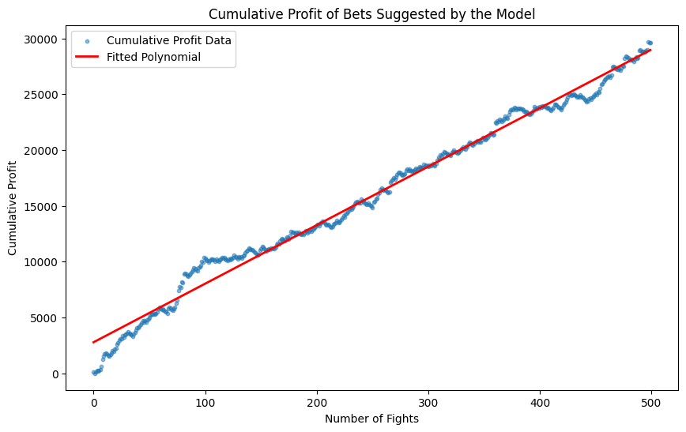
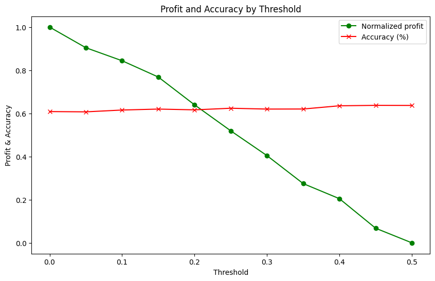

# 🧠 Predictive MMA Betting with Machine Learning

This project develops a machine learning model to predict the probability of victory for MMA fighters and applies those predictions to implement a value-driven betting strategy based on the expected value. It evaluates the financial performance of the model against a benchmark and analyzes key metrics such as cumulative profit, ROI, and confidence intervals.

---

## 📈 Project Overview

- **Goal**: Identify profitable betting opportunities by comparing model-based win probabilities with implied probabilities from bookmakers.
- **Model Used**: `XGBoost Regressor` trained to predict the actual fight outcome as a probability.
- **Data**: Cleaned fight statistics, betting odds, and outcomes collected from UFCStats and BestFightOdds. The actual source of that is at Kaggle as https://www.kaggle.com/datasets/mdabbert/ultimate-ufc-dataset
- **Approach**:
  - Estimate `P(Blue wins)` with a regressor.
  - Compute **Expected Value (EV)** from model predictions and betting odds.
  - Place bets only where the expected value is positive and statistically reliable (threshold filtering).
  - Benchmark performance against a naive strategy of betting on the implied favorite.

---

## 🚀 Results

| Metric                                | Value                          |
|---------------------------------------|--------------------------------|
| Number of fights                      | 500                            |
| Bets placed                           | 475                            |
| Amount bet on each fight              | $100                           |
| **Total Profit**                      | **$29,650**                    |
| Benchmark Profit                      | $23,230                        |
| **ROI**                               | **62.5%**                      |
| Win Rate                              | 60.84%                         |
| $CI_{\text{Win rate}}^{99\%}$         | [55.08%, 66.61%]               |
| $CI_{\text{Profit per bet}}^{99\%}$   | [$33.99, $74.60]               |
| **Equivalent Final Odd**              | **1.624**                      |

--- 
📊 Cumulative profit shows a clear, steady growth over time:



📉 Profit vs. threshold suggests that **lower thresholds maximize profit**, even if accuracy remains stable:



---

## ⚙️ How It Works

1. **Preprocessing**:
   - Feature engineering from fight data (physical stats, win ratios, etc.).
   - Removal of data leakage (e.g., future outcomes or odds).

2. **Model Training**:
   - `XGBRegressor` tuned via `GridSearchCV`.
   - Loss function: `log loss` to reflect probabilistic accuracy.

3. **Betting Logic**:
   - Compute **Expected Value** for both fighters.
   - Place bet on the side with higher EV, **only if EV > 0** and prediction is not too far from implied probability (to avoid noise).
   - Fixed $100 stake per bet.

---

## 🔬 Conclusions

- The model consistently identifies profitable betting opportunities based on value, not just win likelihood.
- Even with simple features and no time-series context, it outperformed a basic benchmark.
- Betting strategies focused on **expected value** outperform those based on raw prediction probabilities or confidence alone.
- The ROI achieved is unusually high for betting applications, suggesting potential for real-world testing or further refinement.

---

## ⚠️ Limitations & Future Work

- **Market dynamics not included**: Odds may change in real-time based on betting volume and line movement.
- **Risk of overfitting**: Despite good CV results, backtesting on unseen time-split data is necessary.
- **No bankroll management**: Fixed bet size is unrealistic in high-stakes scenarios. Kelly Criterion or fractional betting strategies could improve realism.
- **Could incorporate fight context**: e.g. injury reports, or even NLP from pre-fight commentary.
- Implement **automated web scraping** of UFCStats or related sources to keep the fight dataset up to date with the latest events.
- **Schedule periodic updates** (e.g., weekly or monthly) to make predictions on upcoming events using the most recent data.

---

## License

This project is licensed under the MIT License.  
You are free to use, modify, and distribute it for both personal and commercial purposes, as long as the original license is included.  
See the [license](./license.txt) file for full details.

---

## 📂 File Structure

```bash
.
├── EDA.ipynb           # Exploratory Data Analysis and preprocessing pipeline (from raw to clear train/test sets) 
├── xgboost.ipynb       # Full model training, evaluation, betting logic, profit analysis and plots
├── README.md           # Project overview, methodology, results and future work
├── requirements.txt    # List of Python dependencies
├── license.txt         # MIT license
└── data/               # All datasets used throughout the pipeline
    ├── ufc-master.csv      # Original UFC fights dataset
    ├── training_data.csv   # Cleaned training dataset exported from EDA.ipynb
    ├── testing_data.csv    # Cleaned testing dataset exported from EDA.ipynb
    └── testing_odds.csv    # Testing fights odds exported from EDA.ipynb
